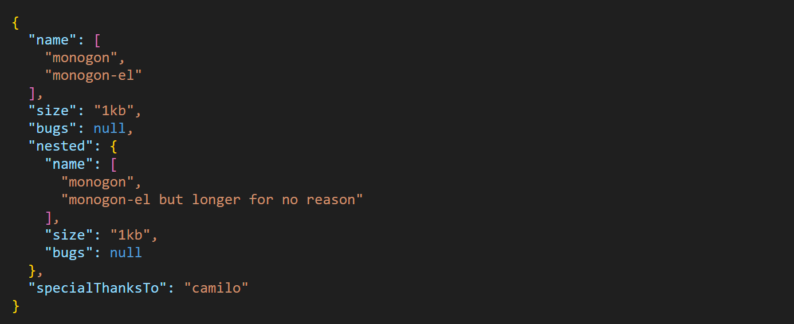

# Monogon

Super lightweight syntax highlighting for modern browsers.



## Usage

Import it

```js
import monogon
```

Use in your HTML

```html
<monogon-el content='{ "names": ["ian", "camilo"], size: "1kb", status: null  }'>Click me</monogon-el>

<script>
  document.querySelector('monogon-el').addEventListener('input', (event) => {
    console.log(event.target.value);
  });
</script>
```

## Frameworks

### Vue

```js
// in <template>
<monogon-el :content="content" @input="handleInput">Click me</monogon-el>

// in <script>
const content = ref('{ "json": ["this", "is", "json"], "how": 42  }')
const handleInput = (e) => {
    content.value = e.target.value
}
```

Vue assumes all [non-native HTML elements are Vue components](https://vuejs.org/guide/extras/web-components#using-custom-elements-in-vue). To resolve this specify in your build config:

```js
plugins: [
  vue({
    template: {
      compilerOptions: {
        // treat all tags with a dash as custom elements
        isCustomElement: (tag) => tag.includes('-'),
      },
    },
  }),
];
```

### With SSR

Since SSR is not yet supported, you need to load it in the browser during page load.

```

```
