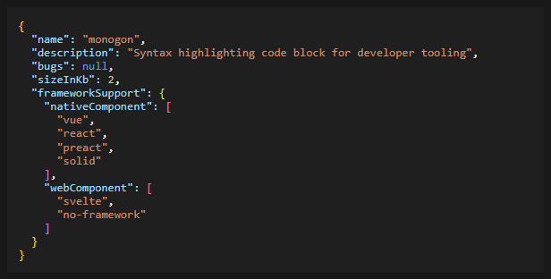

# Monogon

2kb `<code>` block with syntax highlighting meant for the dev environment.

Zero dependencies, support for [most frameworks](#frameworks), mildly [themable](#theming).

Using the CSS Highlight, meaning [low browser support](https://caniuse.com/mdn-api_highlight).



> [!IMPORTANT]
> Monogon is meant for **developer tooling** and supports _very few_ languages. Think config files.
>
> If you don't need editable code snippets, look at [Shiki](https://github.com/shikijs/shiki), it's amazing.
>
> If you need editable snippets, [Codemirror](https://github.com/codemirror/dev/) might be worth a look.
>
> No SSR support for now.

## Supported languages

| Language  | property  | syntax | formatting |
| --------- | --------- | ------ | ---------- |
| JSON      | json      | ✅     | ✅         |
| YAML      | yaml      | ✅     | ❌         |
| CSS       | css       | ❓     | ❌         |
| plaintext | plaintext | -      | -          |

## Usage

Import it

```js
import 'monogon';
```

Use in your HTML as a web component.

```html
<monogon-code lang="json" content='{ "names": ["ian", "ana"], size: "2kb", status: null  }'>Click me</monogon-code>

<script>
  document.querySelector('monogon-code').addEventListener('input', (event) => {
    console.log(event.target.value);
  });
</script>
```

## Frameworks

### Vue

```js
import MonogonCode from 'monogon/vue';

const content = ref('{ "json": ["this", "is", "json"], "how": 42  }')
const handleInput = (e) => { content.value = e.target.value }

<MonogonCode :content="content" @input="handleInput">Click me</MonogonCode>
```

### React

```jsx
import MonogonCode from 'monogon/react';

const content = '{ "json": ["this", "is", "json"], "how": 42  }';
const handleInput = (e) => { console.log(e.target.value) }

<MonogonCode content={content} lang="json" onInput={handleInput} />
```

### Preact

```jsx
import MonogonCode from 'monogon/preact';

const content = '{ "json": ["this", "is", "json"], "how": 42  }';
const handleInput = (e) => { console.log(e.target.value) }

<MonogonCode content={content} lang="json" onInput={handleInput} />
```

### Svelte

There is no native support yet for Svelte, so the web component needs to be used.

```jsx
import 'monogon';

<monogon-code {content} lang="json" oninput={handleInput}></monogon-code>
```

### Solid

```jsx
import MonogonCode from 'monogon/solid';
const handleInput = (e) => { console.log(e.target.value) }

<MonogonCode content={content} lang="json" onInput={handleInput} />
```

## Options

For a read-only code block just add the `readonly` prop/attribute.

## Theming

Monogon comes with a VSCode-like dark and light theme. This theme can be changed by changing the css properties on `monogon-code`.

The simplest way to do so is:

```css
monogon-el.custom-theme-name {
  --mng-background: #0f0;
  /* ...other changes, see lit below */
}
@media (prefers-color-scheme: dark) {
  monogon-el.custom-theme-name {
    --mng-background: #040;
    /* ...other changes, see lit below */
  }
}
```

Full list of css properties used:

```css
.default-theme {
  /* Generic */
  --mng-text: #213547;
  --mng-background: #f1f1f1;
  /* Proper highlighting */
  --mng-string: #8b251e;
  --mng-key: #c32b1d;
  --mng-number: #4a845b;
  --mng-boolean: #3716f5;
  --mng-null: #3716f5;
  --mng-comment: #4e862d;
  --mng-curly-brackets: #59913e;
  --mng-square-brackets: #59913e;
  --mng-keyword: #666;
  --mng-dashes: #444;
}
```

## With SSR

SSR is not yet supported, you need to load it in the browser during page load.

---
Made with 🍕 in Amsterdam.
